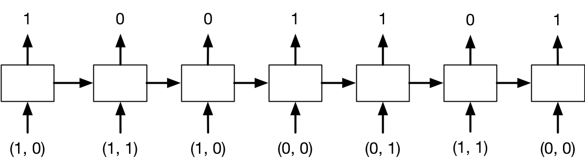

<!-- From Tutorial 9 of past offering -->
In this problem, you will implement a recurrent neural network which implements binary addition.
The inputs are given as binary sequences, starting with the \emph{least} significant binary digit.
(It is easier to start from the least significant bit, just like how you did addition in grade school.)
The sequences will be padded with at least one zero as the most significant digit, so that the output
length is the same as the input length. For example, the 
problem $100111 + 110010$, whose target output value is $1011001$, will be represented as follows:
\begin{align*}
\bf{x}^{(1)} = \begin{bmatrix}1 \\ 0\end{bmatrix},
\bf{x}^{(2)} = \begin{bmatrix}1 \\ 1\end{bmatrix},
\bf{x}^{(3)} = \begin{bmatrix}1 \\ 0\end{bmatrix},
\bf{x}^{(4)} = \begin{bmatrix}0 \\ 0\end{bmatrix},
\bf{x}^{(5)} = \begin{bmatrix}0 \\ 1\end{bmatrix},
\bf{x}^{(6)} = \begin{bmatrix}1 \\ 1\end{bmatrix},
\bf{x}^{(7)} = \begin{bmatrix}0 \\ 0\end{bmatrix}
\end{align*}

With the target output:
\begin{align*}
y^{(1)} = 1,
y^{(2)} = 0,
y^{(3)} = 0,
y^{(4)} = 1,
y^{(5)} = 1,
y^{(6)} = 0,
y^{(7)} = 1,
\end{align*}

There are two input units corresponding to the two inputs,
and one output unit.
Therefore, the pattern of inputs and outputs for this example would be:

{ width=3in }

Design, by hand, the weights and biases for an RNN which has two input units,
three hidden units,
and one output unit, which implements binary addition as discussed above.
All of the units use the hard threshold activation function ($f(x) = 1$ if $x > 0$ and $0$ otherwise).
In particular, specify weight matrices $\mathbf{U}$, $\mathbf{v}$, and $\mathbf{W}$, bias vector $\mathbf{b}_{\mathbf{h}}$, and scalar bias $b_y$ for the following architecture:
\begin{align*}
h^{(t)} &= f(\bf{W}h^{(t-1)} + \bf{U}\bf{x}^{(t)} + \bf{b_h}) \\
y^{(t)} &= f(\bf{v}^T h^{(t)} + b_y)
\end{align*}

(a) What are the shapes of $\mathbf{U}$, $\mathbf{v}$, $\mathbf{W}$, and $\mathbf{b}_{\mathbf{h}}$? 

(b) Come up with values for $\mathbf{U}$, $\mathbf{W}$,  and $\mathbf{b}_{\mathbf{h}}$. Justify your answer. 
__Hint:__ When performing binary addition, in addition to adding up two digits in a column, we need to track whether there is a \textit{carry} digit from the previous column. We will choose one of the three units in $\bf{h}^{(t)}$, say $\bf{h}_2^{(t)}$, to represent this carry digit. You may also find it helpful to set $\bf{h}_1$ to activate if the sum of the 3 digits is at least 1, $\bf{h}_2$ to activate if the sum is at least 2, and $\bf{h}_3$ to activate if the sum is at least 3.

(c) Come up with the values of $\bf{v}$ and $b_y$. Justify your answer.
