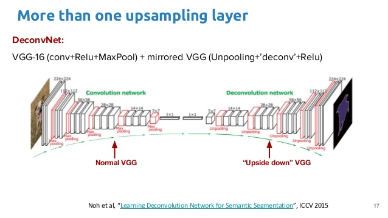
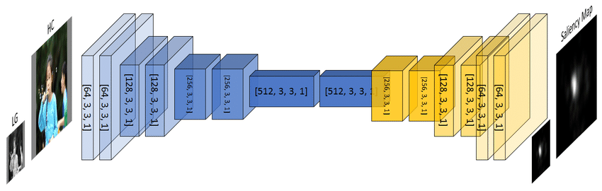
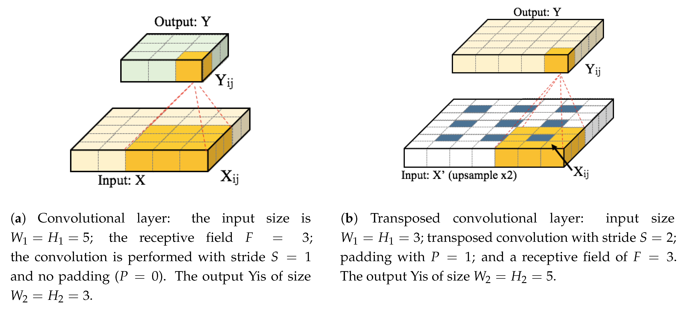
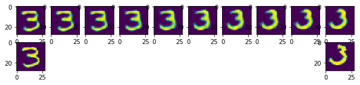

# Transpose Convolution

## Pixel-wise prediction

A prediction problem where we label the content of each pixel is
known as a **pixel-wise prediction problem**

{ height=50% }

Q: How do we generate pixel-wise predictions?

## What we need:

We need to be able to **up-sample** features, i.e.
to obtain high-resolution features from low-resolution features

- Opposite of max-pooling OR
- Opposite of a strided convolution

We need an **inverse** convolution -- a.k.a a **deconvolution** or **transpose convolution**.

## Architectures with Transpose Convolution



## Architectures with Transpose Convolution 2



## Inverse Convolution

```
>>> x = torch.randn(2, 8, 64, 64)
>>> conv = nn.Conv2d(in_channels=8,
...                  out_channels=8,
...                  kernel_size=5)
>>> y = conv(x)
>>> y.shape
```
. . .

```
>>> convt = nn.ConvTranspose2d(in_channels=8,
...                            out_channels=8,
...                            kernel_size=5)
>>> x = convt(y)
>>> x.shape
```

. . .

should get the same shape back!

## Inverse Convolution + Padding

```
>>> x = torch.randn(2, 8, 64, 64)
>>> conv = nn.Conv2d(in_channels=8,
...                  out_channels=8,
...                  kernel_size=5,
...                  padding=2)
>>> y = conv(x)
>>> y.shape
```
. . .

```
>>> convt = nn.ConvTranspose2d(in_channels=8,
...                            out_channels=8,
...                            kernel_size=5,
...                            padding=2)
>>> x = convt(y)
>>> x.shape
```

. . .

should get the same shape back!

## Inverse Convolution + Stride

```
>>> x = torch.randn(2, 8, 64, 64)
>>> conv = nn.Conv2d(in_channels=8,
...                  out_channels=8,
...                  kernel_size=5,
...                  stride=2)
>>> y = conv(x)
>>> y.shape
```
. . .

```
>>> convt = nn.ConvTranspose2d(in_channels=8,
...                            out_channels=8,
...                            kernel_size=5,
...                            stride=2)
>>> x = convt(y)
>>> x.shape
```

. . .

... almost the same shape ...

## Transpose Convolution Layer 



More at `https://github.com/vdumoulin/conv_arithmetic`

## Output Padding

```
nn.ConvTranspose2d(in_channels=8,
                   out_channels=8,
                   kernel_size=5,
                   stride=2,
                   output_padding=1) # +1 to output
                                     # width/height
```


## Autoencoder

To demonstrate ConvTranspose2d, we will build a network that:

- Finds a lower dimensional representation of the image
- Then reconstructs the image from the low-dimensional representation

{ height=60% }

## The components of an autoencoder

{ height=50% }

**Encoder**:

- Input = image
- Output = low-dimensional embedding

**Decoder**:

- Input = low-dimensional embedding
- Output = image

## Why autoencoders?

- Dimension reduction:
    - find a low dimensional representation of the image 
- Image Generation:
    - generate new images not in the training set

Autoencoders are not used for **supervised learning**.
The task is *not* to predict something about the image!

Autoencoders are considered a **generative model**.

## How to train autoencoders?

- Loss function:
    - How close were the reconstructed image from the original?
    - **Mean Sqaure Error Loss**: look at the mean square error
      across all the pixels.
- Optimizer:
    - Just like before!
    - Introduce a new optimizer: `Adam`
    - Commonly used for other network architectures too
- Training loop:
    - Just like before!

## Structure in the Embedding Space

The dimensionality reduction means that there will be structure in the embedding space.

If the dimensionality of the embedding space is not too large, similar images should map to similar locations.

## Interpolating in the Embedding Space




